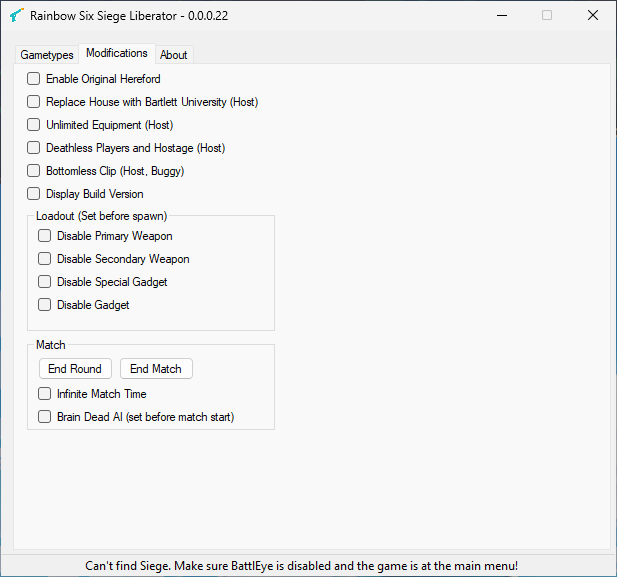

# Liberator



A decrypted version of the [OTB](https://puppetino.github.io/Throwback-FAQ/index.html) tool **Liberator**, which includes Unlock-All and many other modifications.

> [!IMPORTANT]
> Some features may not work as expected. The encrypted version of `0.0.0.22` already exhibited these issues. The original developer was Gamecheat13!

## Requirements

- A supported Rainbow Six Siege build with BattlEye disabled
- [.NET](https://dotnet.microsoft.com/en-us/download/dotnet-framework/net48) Framework 4.8
- Administrator rights, because Liberator writes to the game storage

## Installation

1. Download `Liberator.exe` from the [latest release](https://github.com/Xeralin/Liberator/releases)
2. Run `Liberator.exe` and start Rainbow Six Siege in either order
3. Liberator attaches once the game reaches the main menu

> [!NOTE]
> **Do you use Linux?** Liberator is managed by [Mila](https://github.com/Xeralin/Mila). When you download a season, confirm the prompt *Enable Liberator?* by pressing `Y`, then launch your game via Steam.

## Building

You need the [.NET SDK](https://dotnet.microsoft.com/download). Visual Studio is optional. <br/>
The output is `Liberator.exe` in `Liberator/bin/x64/Release/net48/`.

```sh
git clone https://github.com/Xeralin/Liberator.git
cd Liberator
dotnet build -c Release
```

## Support

| Season | Operation |
|--------|-----------|
| Y1S0 | Vanilla |
| Y1S1 | Black Ice |
| Y1S2 | Dust Line |
| Y1S3 | Skull Rain |
| Y1S4 | Red Crow |
| Y2S1 | Velvet Shell |
| Y2S2 | Health |
| Y2S3 | Blood Orchid |
| Y2S4 | White Noise |
| Y3S1 | Chimera |
| Y3S2 | Para Bellum |
| Y3S3 | Grim Sky |
| Y3S4 | Wind Bastion |
| Y4S1 | Burnt Horizon |
| Y4S2 | Phantom Sight |
| Y4S3 | Ember Rise |
| Y4S4 | Shifting Tides |